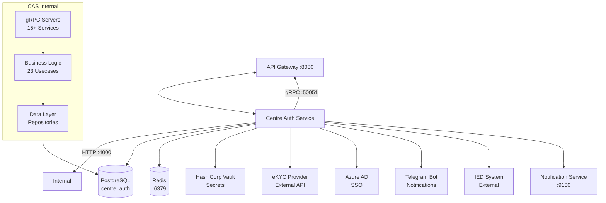

# Centre Auth Service - Architecture Overview

**Author:** thatlq1812  
**Created:** 2025-12-18  
**Last Updated:** 2025-12-18  
**Version:** 1.0.0  
**Status:** Active

---

## Purpose

Centre Auth Service (CAS) is the centralized authentication and authorization microservice for the AgriOS platform. It manages user identities, access control, farmer/supplier profiles, and eKYC verification for all microservices in the ecosystem.

**Target Audience:**
- Backend developers implementing or integrating with CAS
- DevOps engineers deploying and maintaining the service
- QA engineers testing authentication flows
- Technical leads understanding system design

---

## Service Information

| Property | Value |
|----------|-------|
| **Service Name** | centre-auth-service |
| **Protocol** | gRPC + HTTP REST |
| **gRPC Port** | 50051 |
| **HTTP Port** | 4000 |
| **Database** | PostgreSQL (centre_auth) |
| **Cache** | Redis (standalone mode) |
| **Language** | Go 1.21+ |
| **Framework** | gRPC, Fiber (HTTP) |

---

## Core Responsibilities

### 1. Authentication Management
- User registration and login (email, phone, employee ID)
- Multi-source account support (web, app)
- JWT token generation and validation
- Token refresh and revocation
- Session management with device tracking
- Azure AD SSO integration

### 2. Mobile Authentication
- OTP (One-Time Password) generation and verification
- PIN-based authentication for mobile apps
- Rate limiting and cooldown protection
- Device fingerprinting

### 3. Authorization (RBAC)
- Role-Based Access Control using Casbin
- Dynamic permission assignment
- Resource-level authorization
- Policy enforcement via gRPC interceptors

### 4. Account Management
- Unified account model for all user types:
  - Farmers (agricultural producers)
  - Suppliers (input providers)
  - Prospects (potential customers)
  - Investors (financial stakeholders)
  - Staff (internal employees)
- Account profile CRUD operations
- Soft delete with audit trail
- Multi-source account isolation (web vs app)

### 5. Farmer Domain
- Farmer profile management
- Land parcel registration with GIS polygons
- FRM (Farmer Registration Module) integration
- Farmer hub assignments
- Integration with external FRM system

### 6. Supplier Domain
- Supplier profile management
- Business field categorization
- Representative position tracking
- Supplier hub assignments
- Verification status management

### 7. eKYC Integration
- Identity verification via external eKYC provider
- Document scanning (ID cards, passports)
- Face comparison and liveness detection (2D and 3D)
- Face mask detection
- OCR data extraction
- Card liveness verification

### 8. Device Management
- Device session tracking
- Multi-device login support
- Device revocation capabilities

### 9. Consent Management
- Consent logging for data privacy compliance
- Consent policy management
- Audit trail for user consents

---

## Architecture Overview

### High-Level Architecture



### Technology Stack

**Core Framework:**
- **Language:** Go 1.21+
- **gRPC Framework:** google.golang.org/grpc v1.65
- **HTTP Framework:** Fiber v2 (for REST API)

**Database & Cache:**
- **Database:** PostgreSQL 14+
  - ORM: GORM v2
  - Migrations: SQL files (70+ migrations)
- **Cache:** Redis 7+
  - Client: go-redis/redis/v9
  - Used for: Token blacklist, rate limiting

**Authentication & Authorization:**
- **JWT:** golang-jwt/jwt/v5
- **RBAC:** Casbin v2 (Policy enforcement)
- **Password Hashing:** bcrypt

**Observability:**
- **Logging:** Uber Zap (structured JSON logging)
- **Tracing:** OpenTelemetry (OTLP exporter)
- **Metrics:** StatsD (Prometheus-compatible)

**External Integrations:**
- **eKYC:** Custom client for identity verification
- **IED:** Industrial Estate Development system
- **Azure Storage:** File upload/storage (Azure Blob)
- **Azure AD:** SSO authentication (OAuth2)
- **Telegram:** Bot notifications (development)
- **Notification Service:** SMS/Email via gRPC

**Development Tools:**
- **Build:** Makefile
- **Linting:** golangci-lint
- **Containerization:** Docker
- **CI/CD:** Azure Pipelines

---

## Project Structure

```
centre-auth-service/
├── cmd/
│   └── app/
│       └── main.go           # Application entry point
│
├── config/
│   ├── config.yaml          # Main configuration
│   ├── config.go            # Config struct
│   └── casbin_model.conf    # RBAC policy model
│
├── internal/
│   ├── api/                 # HTTP REST API (port 4000)
│   │   ├── init.go          # Dependencies initialization
│   │   └── run.go           # Fiber server startup
│   │
│   ├── grpc/                # gRPC servers (port 50051)
│   │   ├── server.go        # gRPC server setup
│   │   ├── auth_server.go   # Authentication service
│   │   ├── account_server.go # Account management
│   │   ├── user_server.go   # User operations
│   │   ├── mobile_auth_server.go # Mobile auth
│   │   ├── farmer_server.go # Farmer domain
│   │   ├── supplier_server.go # Supplier domain
│   │   ├── role_server.go   # RBAC roles
│   │   ├── permission_server.go # RBAC permissions
│   │   ├── device_server.go # Device sessions
│   │   ├── ekyc_*.go        # 10 eKYC services
│   │   └── ied_server.go    # IED integration
│   │
│   ├── usecase/             # Business logic (23 usecases)
│   │   ├── auth_usecase.go
│   │   ├── account_usecase.go
│   │   ├── mobile_auth_usecase.go
│   │   ├── farmer_usecase.go
│   │   ├── supplier_usecase.go
│   │   ├── ekyc_usecase.go
│   │   └── ... (17 more)
│   │
│   ├── repository/          # Data access layer
│   │   └── postgres/        # PostgreSQL implementations
│   │
│   ├── domain/              # Domain models (entities)
│   │   ├── account.go
│   │   ├── user.go
│   │   ├── farmer.go
│   │   ├── supplier.go
│   │   └── ...
│   │
│   ├── services/            # External service clients
│   │   ├── azure_service.go # Azure AD integration
│   │   ├── ekyc_client.go   # eKYC API client
│   │   └── ied_client.go    # IED API client
│   │
│   └── util/                # Utilities
│
├── migrations/              # Database migrations (70+ SQL files)
│   ├── 001_create_users_table.sql
│   ├── 002_create_accounts_table.sql
│   └── ...
│
├── proto/                   # Proto definitions (imported from Core)
│   ├── auth/v1/
│   ├── account/v1/
│   ├── mobile/v1/
│   ├── farmer/v1/
│   ├── supplier/v1/
│   ├── ekyc/v1/
│   └── ... (15 proto packages)
│
└── pkg/                     # Shared packages
    ├── jwt/                 # JWT token management
    ├── casbin/              # Authorization policies
    ├── ekyc/                # eKYC client
    ├── ied/                 # IED client
    ├── storage/             # Azure Blob Storage
    ├── telegram/            # Telegram notifications
    └── ...
```

---

## gRPC Services

The service exposes **15 gRPC service packages** through a single gRPC server:

| Service | Proto Package | Purpose |
|---------|---------------|---------|
| **AuthService** | `auth.v1` | User authentication (register, login, logout) |
| **AccountService** | `account.v1` | Account management (CRUD, filtering) |
| **UserService** | `user.v1` | User profile operations |
| **MobileAuthService** | `mobile.v1` | Mobile authentication (OTP, PIN) |
| **RoleService** | `role.v1` | RBAC role management |
| **PermissionService** | `permission.v1` | RBAC permission management |
| **DeviceService** | `device.v1` | Device session management |
| **FarmerService** | `farmer.v1` | Farmer profile operations |
| **SupplierService** | `supplier.v1` | Supplier profile operations |
| **IEDService** | `ied.v1` | IED system integration |
| **FileService** | `ekyc.v1` | eKYC file upload |
| **OCRService** | `ekyc.v1` | eKYC OCR extraction |
| **LivenessService** | `ekyc.v1` | Card liveness detection |
| **FaceLivenessService** | `ekyc.v1` | Face liveness (2D) |
| **FaceLiveness3DService** | `ekyc.v1` | Face liveness (3D) |
| **FaceCompareService** | `ekyc.v1` | Face comparison |
| **FaceCompareGeneralService** | `ekyc.v1` | General face comparison |
| **FaceMaskService** | `ekyc.v1` | Face mask detection |
| **EKYCAuthService** | `ekyc.v1` | eKYC authentication |
| **EkycDataService** | `ekyc.v1` | eKYC data management |

---

## Configuration

### Environment Variables

Key configuration from `config/config.yaml`:

```yaml
server:
  name: "centre-auth-service"
  port: "4000"              # HTTP port
  env: "development"

grpc:
  enabled: true
  port: 50051               # gRPC port

database:
  host: "localhost"
  port: 5432
  username: "postgres"
  password: "postgres"
  database: "centre_auth"
  schema: "public"
  ssl_mode: "disable"

cache:
  redis:
    mode: "standalone"
    address:
      - "localhost:6379"

jwt:
  secret_key_web: "your-web-secret"      # For web accounts
  secret_key_app: "your-app-secret"      # For mobile accounts
  access_token_duration: 15m
  refresh_token_duration: 168h           # 7 days

otp:
  expire_seconds: 120                    # OTP valid for 2 minutes
  verified_grace_seconds: 180            # After verify, usable for 3 minutes
  max_per_day: 5
  cooldown_seconds: 120

telemetry:
  enabled: true
  service_name: "centre-auth-service"
  exporter_type: "otlp-http"
  otlp_endpoint: "localhost:4318"
  sampling_ratio: 1.0

services:
  notification: "localhost:9100"         # Notification service gRPC
```

### Source-Specific JWT Secrets

CAS uses **different JWT secrets for different account sources**:
- `secret_key_web`: For accounts with `source=web` (admin portals)
- `secret_key_app`: For accounts with `source=app` (mobile apps)

This provides token isolation between platforms.

### Vault Integration

Supports HashiCorp Vault for secret management:
- Database credentials
- JWT secrets
- External API keys

Enable via `vault.enabled: true` in config.

---

## Key Features

### 1. Multi-Source Account System

Accounts can have different `source` values:
- **web**: Admin portal, backoffice systems
- **app**: Mobile applications (farmer app, supplier app)

Each source:
- Uses its own JWT secret key
- Has isolated token validation
- Supports different authentication flows

### 2. Flexible Identifier System

Users can register/login using multiple identifier types:
- **Email**: `user@example.com`
- **Phone**: `+84912345678`
- **Employee ID**: `EMP001`

The system auto-detects identifier type if not explicitly provided.

### 3. OTP with Rate Limiting

Mobile authentication includes protection:
- **OTP Expiry**: 120 seconds for verification
- **Grace Period**: 180 seconds after verification to complete registration
- **Max OTP per Day**: 5 per phone number
- **Cooldown**: 120 seconds between OTP requests

### 4. Comprehensive eKYC Integration

CAS acts as a proxy to eKYC provider with 10 service endpoints:
- File upload for documents
- OCR extraction from ID cards
- Card liveness detection
- Face liveness detection (2D and 3D)
- Face comparison (1:1 and 1:N)
- Face mask detection

### 5. Audit Logging

All critical operations are logged to `audit_logs` table:
- Account creation/updates
- Permission changes
- Role assignments
- Login attempts
- eKYC verifications

### 6. Soft Delete

All entities support soft delete:
- `deleted_at` timestamp field
- Deleted records excluded from queries by default
- Audit trail preserved
- Can be restored if needed

### 7. Device Session Management

Tracks user sessions across multiple devices:
- Device fingerprinting
- Session metadata (OS, browser, IP)
- Concurrent session support
- Remote device revocation

---

## Database Overview

**Database Name:** `centre_auth`  
**Total Tables:** 50+  
**Total Migrations:** 70+ SQL files

### Key Tables

| Table | Purpose | Key Fields |
|-------|---------|------------|
| **users** | Base user records | id, name, email, phone, employee_id |
| **accounts** | Account profiles | id, user_id, type, identifier, source |
| **refresh_tokens** | JWT refresh tokens | token, account_id, expires_at |
| **otp_verifications** | OTP codes | id (UUID), phone, code, verified |
| **device_sessions** | Active sessions | id, account_id, device_info |
| **farmers** | Farmer profiles | id, account_id, farm_size |
| **parcel_lands** | Land parcels | id, farmer_id, area |
| **polygon_coordinates** | GIS coordinates | id, parcel_land_id, lat, lng |
| **suppliers** | Supplier profiles | id, account_id, business_fields |
| **business_fields** | Supplier categories | id, name |
| **representative_positions** | Supplier representatives | id, name |
| **ekycs** | eKYC records | id, account_id, status |
| **casbin_rule** | RBAC policies | ptype, v0, v1, v2 |
| **roles** | RBAC roles | id, name |
| **permissions** | RBAC permissions | id, resource, action |
| **farmer_hubs** | Farmer hub assignments | id, account_id, hub_name |
| **supplier_hubs** | Supplier hub assignments | id, account_id, hub_name |
| **consent_logs** | User consents | id, account_id, policy_code |
| **consent_policies** | Consent policies | id, code, title |
| **audit_logs** | System audit trail | id, entity_type, action |

---

## Security Considerations

### 1. Password Security
- Passwords hashed with bcrypt (cost factor 10)
- Never stored in plain text
- Minimum password length: 8 characters
- Password validation enforced at registration

### 2. Token Security
- JWT tokens with expiration (15min access, 7 days refresh)
- Refresh token rotation on each use
- Token blacklist for revocation (Redis-based)
- Source-specific secret keys (web vs app)

### 3. API Security
- gRPC interceptors for authentication
- Permission checks on endpoints (via Casbin)
- Rate limiting on OTP endpoints
- Input validation using buf.validate in proto

### 4. Data Protection
- Soft delete preserves audit trail
- Sensitive data encrypted at rest (Vault)
- SQL injection prevention via GORM
- Personal data handling complies with consent management

---

## Performance Characteristics

### Expected Load
- **Concurrent Users:** 10,000+
- **Requests/Second:** 1,000+
- **Database Connections:** 25 max open, 5 idle
- **Cache Hit Ratio:** 80%+ for token validation

### Optimization Strategies
- Redis caching for token validation
- Database connection pooling
- Indexed queries on accounts, users, permissions
- Lazy loading of related entities
- gRPC connection reuse

---

## Monitoring & Health Checks

### Health Endpoints
- **HTTP:** `GET :4000/health` (if implemented)
- **gRPC:** Reflection enabled for testing

### Metrics
- **Prometheus:** Exposed at `/metrics`
- **StatsD:** Custom metrics sent to localhost:8125

### Key Metrics to Monitor
- Login success/failure rate
- Token validation latency
- Database query performance
- Cache hit/miss ratio
- OTP delivery success rate
- eKYC verification latency

---

## Integration with API Gateway

CAS is exposed through the API Gateway. Gateway routes REST/JSON requests to gRPC:

```text
HTTP Request → API Gateway :8080
              ↓ (REST/JSON to gRPC)
          gRPC Call → CAS :50051
              ↓
          Response → Client (JSON)
```

**Example Gateway Routes:**
- `POST /api/v1/auth/login` → `cas-service:50051/auth.v1.AuthService/Login`
- `GET /api/v1/auth/profile` → `cas-service:50051/auth.v1.AuthService/GetProfile`
- `POST /api/v1/accounts` → `cas-service:50051/account.v1.AccountService/CreateAccount`

**Gateway Configuration:**
```yaml
# app-api-gateway/config/config.yaml
services:
  cas-service: "localhost:50051"
```

---

## Development Workflow

### Local Development

```bash
# 1. Setup database
createdb -U postgres centre_auth

# 2. Configure service
cp config/config.example.yaml config/config.yaml
# Edit config/config.yaml with your settings

# 3. Run service (auto-migrates DB)
make api
# Service starts on gRPC :50051 and HTTP :4000

# 4. Verify running
grpcurl -plaintext localhost:50051 list
```

### Build & Test

```bash
# Build binary
make build

# Run tests
make test

# Lint code
make lint

# Generate proto (if needed)
make proto
```

---

---

## Navigation

**Documentation Home:** [README](../../README.md)

**Related Documentation:**
- [API Reference](../api/api_reference.md) - Complete API documentation
- [Database Schema](../database/schema.md) - Detailed schema and relationships
- [Testing Guide](../guides/testing_guide.md) - How to test each API
- [Deployment Guide](../guides/deployment_guide.md) - Production deployment

**Project Documentation:**
- [CHANGELOG](../CHANGELOG.md) - Version history
- [Port Allocation](../../../docs/PORT_ALLOCATION.md) - System-wide ports

---

**Version:** 1.0.0 | **Last Updated:** 2025-12-18 | [Back to Top](#centre-auth-service---architecture-overview)
